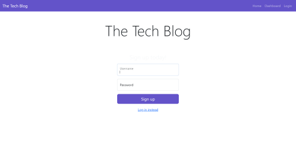
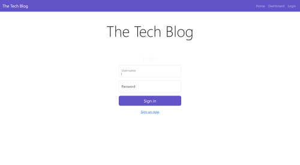
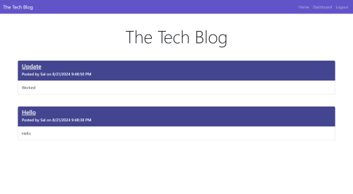
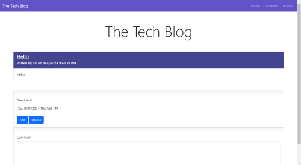
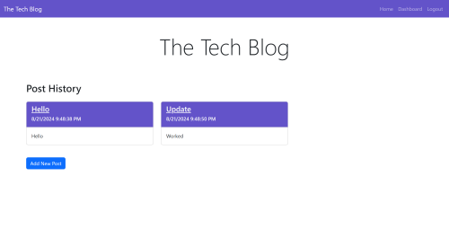
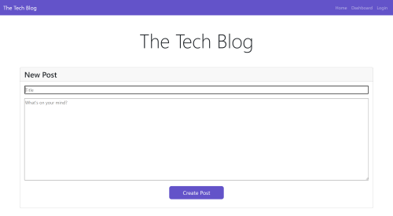
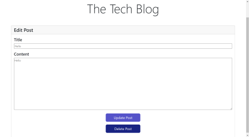

# The Tech Blog

## Table of Contents
- [Description](#description)
- [Features](#features)
- [Installation](#installation)
- [Start](#start)
- [Screenshot](#screenshot)
- [Links](#links)

## Description
The Tech Blog is a platform where users can share and discuss the latest trends and technologies in the tech industry. It allows users to create, edit, and delete posts, as well as comment on posts made by others.

## Features
- User authentication and authorization
- Create, edit, and delete blog posts
- Create, edit, and delete comments on blog posts
- Responsive design
- RESTful API

## Installation
 ```
npm install
  ```

## Start
 ```
node server.js 
  ```
## Screenshot














## Links

[Render Live URL](https://the-tech-blog-nml3.onrender.com)

[GitHub Repo](https://github.com/zoniaramirez/the-tech-blog)
